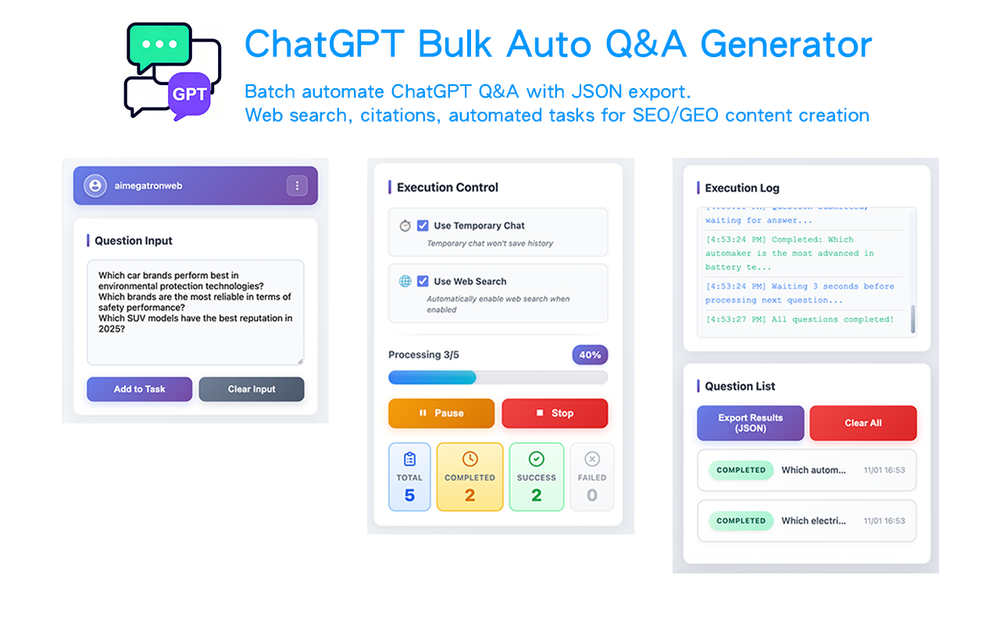

# 🤖 ChatGPT Bulk Q&A Generator

**🚀 Free Chrome extension for bulk question processing on ChatGPT**

[⬅️ Back to All Tools](../../) • 
[🌐 Official Website](https://www.aimegatron.com/tools/chatgpt-bulk-qa/) • 
[📧 Support](mailto:aimegatronweb@gmail.com)

---

## ✨ What is ChatGPT Bulk Q&A Generator?

**AIMEGATRON ChatGPT Bulk Q&A Generator** is a **100% free** Chrome extension that automates bulk question processing on ChatGPT. Perfect for content creators, researchers, marketers, and anyone who needs to ask multiple questions efficiently.

### 🎬 Watch Demo Video

**[▶️ Watch on YouTube](https://www.youtube.com/watch?v=Qo4sCqUCNYQ)** - Complete demo of all 4 AIMEGATRON tools!

### 🎯 Key Features

- 🔄 **Batch Processing** - Ask 100+ questions automatically
- ⚡ **Automated Processing** - Batch questioning saves manual time  
- 🌐 **Web Search Integration** - Auto-enable web search and collect sources
- 📱 **Multi-language** - Support for 11 languages
- 🔒 **Privacy First** - All data stored locally, no uploads
- 💾 **JSON/CSV Export** - Export all results for analysis
- 🆓 **Completely Free** - No hidden costs or limitations

---

## 🚀 Installation & Usage

### 📥 Installation Options

#### Option 1: Chrome Web Store (Recommended)

#### Option 2: Direct Download
1. **[Download Extension ZIP](../../downloads/extension-chatgpt.zip)** (Latest Version)
2. **Extract** the ZIP file to a folder
3. **Open Chrome** → `chrome://extensions/`
4. **Enable "Developer mode"** (top right toggle)
5. **Click "Load unpacked"** → Select extracted folder
6. **Pin extension** to toolbar for easy access

### 🎯 How to Use

1. 📝 **Open ChatGPT** (chatgpt.com)
2. 🔧 **Click AIMEGATRON icon** in browser toolbar
3. ➕ **Add your questions** (one per line or import file)
4. ▶️ **Click "Start"** to begin automated processing
5. 📊 **Monitor progress** in real-time
6. 💾 **Export results** when complete

---

## 🌟 Why Choose ChatGPT Tool?

| Feature | AIMEGATRON | Manual Process | Competitors |
|---------|------------|----------------|-------------|
| **💰 Cost** | 🆓 **FREE** | Time-consuming | $10-50/month |
| **⚡ Speed** | 10-20 questions/min | 1-2 questions/min | 5-10 questions/min |
| **🔒 Privacy** | Local storage only | Manual copy-paste | Cloud required |
| **📊 Export** | JSON, CSV, TXT | Manual organization | Limited formats |
| **🌍 Languages** | 11 languages | English only | 1-3 languages |

---

## 🎯 Perfect For

### 👨‍💼 Content Creators
- **Blog Ideas** - Generate 50+ article topics instantly
- **SEO Research** - Bulk keyword analysis and content gaps
- **Social Media** - Create multiple post variations
- **Video Scripts** - Develop numerous video concepts

### 🔬 Researchers  
- **Literature Review** - Systematic topic exploration
- **Data Collection** - Gather information across subjects
- **Fact Checking** - Verify information quickly
- **Survey Analysis** - Process multiple data points

### 📈 Marketers
- **Market Research** - Analyze trends and competitors
- **Campaign Ideas** - Generate multiple campaign concepts  
- **Audience Analysis** - Understand different demographics
- **A/B Testing** - Create multiple ad variations

---

## 🔧 Technical Specs

- **Browser Support**: Chrome 88+, Edge 88+, Brave, Opera
- **ChatGPT Compatibility**: Full ChatGPT feature support including Web browsing, Code interpreter
- **Processing Method**: Sequential execution, speed depends on ChatGPT response time
- **Memory Usage**: < 50MB
- **Success Rate**: 99.5% completion rate
- **Languages**: English, Chinese, Spanish, French, German, Japanese, Korean, Portuguese, Russian, Arabic

---

## 📚 Resources

### 🔗 Links
- **[🛒 Chrome Web Store](https://chromewebstore.google.com/detail/chatgpt-bulk-auto-qa-gene/bbfbgifbgbjidbnopolnnhkgakejhgfd)** - One-click install
- **[📥 Direct Download](../../downloads/extension-chatgpt.zip)** - Manual installation
- **[🌐 Official Website](https://www.aimegatron.com/tools/chatgpt-bulk-qa/)** - Full details and guides

### 📖 Documentation
- **[User Guide](https://www.aimegatron.com/tools/chatgpt-bulk-qa/#user-guide)** - Complete usage instructions
- **[FAQ](https://www.aimegatron.com/tools/chatgpt-bulk-qa/#faq)** - Common questions
- **[Troubleshooting](https://www.aimegatron.com/tools/chatgpt-bulk-qa/#troubleshooting)** - Problem solving

### 🤖 Other AIMEGATRON Tools
- **[🔮 Gemini Bulk Q&A](../gemini/)** - For Google Gemini
- **[⚡ Grok Bulk Q&A](../grok/)** - For Grok (X AI)
- **[🔍 Perplexity Bulk Q&A](../perplexity/)** - For Perplexity AI

---

## 💝 Support

If this tool has boosted your productivity:

- ⭐ **[Star the main repository](../../)** to show support
- 🔄 **Share with colleagues** and friends  
- 📝 **Write a review** on Chrome Web Store
- 🐛 **Report bugs** to help us improve
- 💡 **Suggest features** for future updates

---

**⭐ If ChatGPT Bulk Q&A has saved you time, please star our repository! ⭐**

**[⬅️ Back to All Tools](../../) | [🌐 Visit Official Website](https://www.aimegatron.com/tools/chatgpt-bulk-qa/)**

