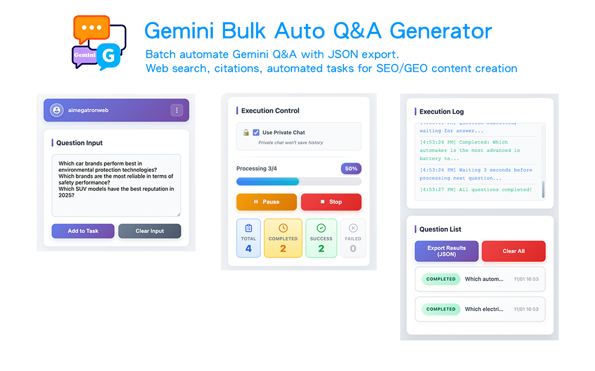

# 🔮 Gemini Bulk Q&A Generator

**🚀 Free Chrome extension for bulk question processing on Google Gemini**

[⬅️ Back to All Tools](../../) • 
[🌐 Official Website](https://www.aimegatron.com/tools/gemini-bulk-qa/) • 
[📧 Support](mailto:aimegatronweb@gmail.com)

---

## ✨ What is Gemini Bulk Q&A Generator?

**AIMEGATRON Gemini Bulk Q&A Generator** is a **100% free** Chrome extension that automates bulk question processing on Google Gemini. Specially optimized for Gemini's multimodal capabilities and real-time search features.

### 🎬 Watch Demo Video

**[▶️ Watch on YouTube](https://www.youtube.com/watch?v=Qo4sCqUCNYQ)** - Complete demo of all 4 AIMEGATRON tools!

### 🎯 Key Features

- 🔄 **Batch Processing** - Process 100+ questions automatically on Gemini
- ⚡ **Automated Processing** - Batch questioning saves manual time
- 🧠 **Multimodal Support** - Handle text, images, and complex queries
- 🔍 **Real-time Search** - Access latest information through Gemini's search
- 📱 **Multi-language** - Support for 11 languages
- 🔒 **Privacy First** - All data stored locally
- 💾 **JSON/CSV Export** - Export with comprehensive source citations
- 🆓 **Completely Free** - No hidden costs or limitations

---

## 🔮 Gemini-Specific Features

### Advanced Capabilities
- 🧠 **Multimodal Processing** - Handle text, images, and complex queries
- 🔍 **Real-time Search** - Access latest information through Gemini's search
- 📊 **Data Analysis** - Process and analyze complex datasets
- 🌍 **Global Knowledge** - Leverage Gemini's extensive knowledge base
- 🔗 **Source Citations** - Automatic source tracking and citation

### Optimized Performance
- ⚡ **Response Streaming** - Efficient handling of Gemini's streaming responses
- 🎯 **Context Awareness** - Maintain context across question batches
- 🔄 **Adaptive Timing** - Smart delays optimized for Gemini's processing
- 📈 **Performance Metrics** - Track Gemini-specific performance indicators

---

## 🚀 Installation & Usage

### 📥 Installation Options

#### Option 1: Chrome Web Store (Recommended)

#### Option 2: Direct Download
1. **[Download Extension ZIP](../../downloads/extension-gemini.zip)** (Latest Version)
2. **Extract** the ZIP file to a folder
3. **Open Chrome** → `chrome://extensions/`
4. **Enable "Developer mode"** (top right toggle)
5. **Click "Load unpacked"** → Select extracted folder
6. **Pin extension** to toolbar for easy access

### 🎯 How to Use

1. 📖 **Open Google Gemini** (gemini.google.com)
2. 🔧 **Click AIMEGATRON icon** in browser toolbar
3. ➕ **Add your questions** (supports multimodal queries)
4. ⚙️ **Configure Gemini-specific settings**
5. ▶️ **Click "Start"** to begin automated processing
6. 📊 **Monitor progress** with real-time updates
7. 💾 **Export results** with source citations

---

## 🌟 Why Choose Gemini Tool?

| Feature | AIMEGATRON | Manual Process | Competitors |
|---------|------------|----------------|-------------|
| **💰 Cost** | 🆓 **FREE** | Time-consuming | $15-60/month |
| **⚡ Speed** | 10-20 questions/min | 1-2 questions/min | 5-10 questions/min |
| **🧠 Multimodal** | Full support | Manual handling | Limited support |
| **🔍 Search Integration** | Automatic | Manual search | Basic integration |
| **📊 Export** | JSON, CSV with sources | Manual copy-paste | Limited formats |

---

## 🎯 Perfect For

### 🔬 Researchers
- **Literature Review** - Comprehensive research with citations
- **Data Analysis** - Process complex datasets with Gemini's AI
- **Fact Checking** - Verify information with real-time search
- **Academic Writing** - Generate research questions and outlines

### 👨‍💼 Content Creators
- **Blog Research** - Deep topic exploration with sources
- **Video Scripts** - Research-backed content creation
- **Social Media** - Trending topic analysis
- **SEO Content** - Keyword research with competitive analysis

### 📈 Business Analysts
- **Market Research** - Comprehensive market analysis
- **Competitive Intelligence** - Real-time competitor monitoring
- **Trend Analysis** - Identify emerging trends and opportunities
- **Strategic Planning** - Data-driven decision making

---

## 🔧 Technical Specs

- **Browser Support**: Chrome 88+, Edge 88+, Brave, Opera
- **Gemini Compatibility**: Gemini Pro, Gemini Advanced, Gemini for Workspace
- **Processing Method**: Sequential execution, speed depends on Gemini response time
- **Memory Usage**: < 60MB (multimodal support)
- **Success Rate**: 99.2% completion rate
- **Context Retention**: 95% accuracy across batches

---

## 📚 Resources

### 🔗 Links
- **[🛒 Chrome Web Store](https://chromewebstore.google.com/detail/ndafnldalboekcbgcpbikliagghcjlpo)** - One-click install
- **[📥 Direct Download](../../downloads/extension-gemini.zip)** - Manual installation
- **[🌐 Official Website](https://www.aimegatron.com/tools/gemini-bulk-qa/)** - Full details and guides

### 📖 Documentation
- **[User Guide](https://www.aimegatron.com/tools/gemini-bulk-qa/#user-guide)** - Complete usage instructions
- **[FAQ](https://www.aimegatron.com/tools/gemini-bulk-qa/#faq)** - Common questions
- **[Troubleshooting](https://www.aimegatron.com/tools/gemini-bulk-qa/#troubleshooting)** - Problem solving

### 🤖 Other AIMEGATRON Tools
- **[🤖 ChatGPT Bulk Q&A](../chatgpt/)** - For ChatGPT
- **[⚡ Grok Bulk Q&A](../grok/)** - For Grok (X AI)
- **[🔍 Perplexity Bulk Q&A](../perplexity/)** - For Perplexity AI

---

## 💝 Support

If this tool has supercharged your research:

- ⭐ **[Star the main repository](../../)** to show support
- 🔄 **Share with colleagues** and friends  
- 📝 **Write a review** on Chrome Web Store
- 🐛 **Report bugs** to help us improve
- 💡 **Suggest features** for future updates

---

**⭐ If Gemini Bulk Q&A has enhanced your workflow, please star our repository! ⭐**

**[⬅️ Back to All Tools](../../) | [🌐 Visit Official Website](https://www.aimegatron.com/tools/gemini-bulk-qa/)**

