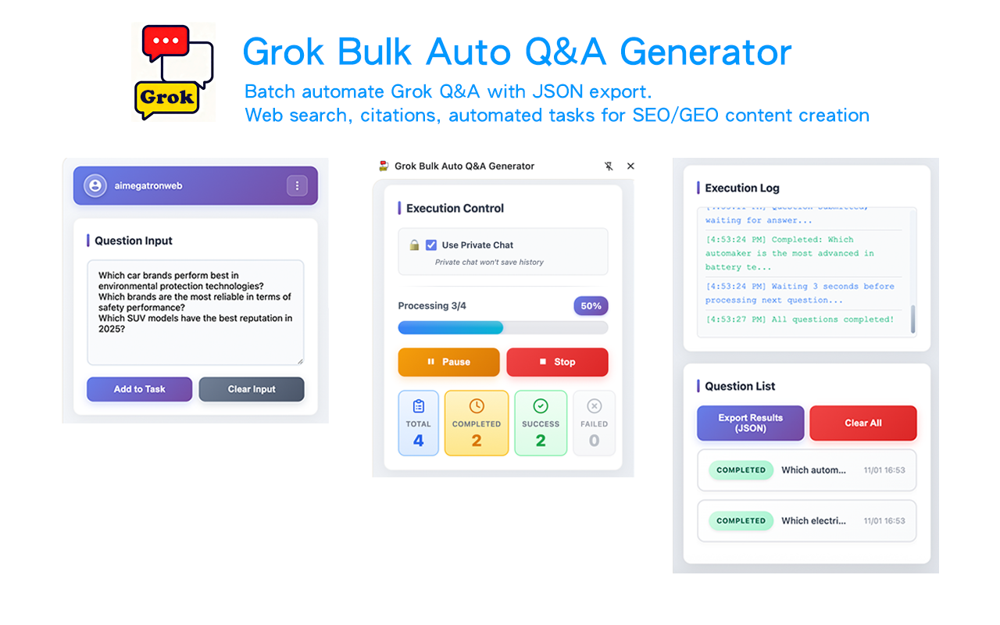

# ⚡ Grok Bulk Q&A Generator

**🚀 Free Chrome extension for bulk question processing on Grok (X AI)**

[⬅️ Back to All Tools](../../) • 
[🌐 Official Website](https://www.aimegatron.com/tools/grok-bulk-qa/) • 
[📧 Support](mailto:aimegatronweb@gmail.com)

---

## ✨ What is Grok Bulk Q&A Generator?

**AIMEGATRON Grok Bulk Q&A Generator** is a **100% free** Chrome extension that automates bulk question processing on Grok (X AI). Optimized for Grok's real-time intelligence, witty responses, and X platform integration.

### 🎬 Watch Demo Video

**[▶️ Watch on YouTube](https://www.youtube.com/watch?v=Qo4sCqUCNYQ)** - Complete demo of all 4 AIMEGATRON tools!

### 🎯 Key Features

- 🔄 **Batch Processing** - Process 100+ questions automatically on Grok
- ⚡ **15x Faster** - Grok's quick responses mean faster processing
- 🌐 **Real-time Data** - Access live information from X and the web
- 🧠 **Witty Responses** - Leverage Grok's unique personality and humor
- 📱 **Multi-language** - Support for 11 languages
- 🔒 **Privacy First** - All data stored locally
- 💾 **JSON/CSV Export** - Export all results for analysis
- 🆓 **Completely Free** - No hidden costs or limitations

---

## ⚡ Grok-Specific Features

### Real-time Intelligence
- 🌐 **Live Data Access** - Real-time information from X and the web
- 🧠 **Witty Responses** - Grok's unique personality and humor
- 📊 **Trend Analysis** - Access to trending topics and discussions
- 🔍 **Social Context** - Understanding of social media context
- ⚡ **Fast Processing** - Optimized for Grok's quick response times

### X Platform Integration
- 🐦 **Tweet Analysis** - Process and analyze tweet content
- 📈 **Trend Monitoring** - Track trending topics and hashtags
- 👥 **Social Insights** - Understand social media conversations
- 🔗 **Link Processing** - Handle X links and embedded content

---

## 🚀 Installation & Usage

### 📥 Installation Options

#### Option 1: Chrome Web Store (Recommended)

#### Option 2: Direct Download
1. **[Download Extension ZIP](../../downloads/extension-grok.zip)** (Latest Version)
2. **Extract** the ZIP file to a folder
3. **Open Chrome** → `chrome://extensions/`
4. **Enable "Developer mode"** (top right toggle)
5. **Click "Load unpacked"** → Select extracted folder
6. **Pin extension** to toolbar for easy access

### 🎯 How to Use

1. 📖 **Open Grok** (grok.com)
2. 🔧 **Click AIMEGATRON icon** in browser toolbar
3. ➕ **Add your questions** (one per line or import file)
4. ⚙️ **Configure Grok-specific settings**
5. ▶️ **Click "Start"** to begin automated processing
6. 📊 **Monitor progress** with real-time updates
7. 💾 **Export results** when complete

---

## 🌟 Why Choose Grok Tool?

| Feature | AIMEGATRON | Manual Process | Competitors |
|---------|------------|----------------|-------------|
| **💰 Cost** | 🆓 **FREE** | Time-consuming | $20-70/month |
| **⚡ Speed** | 15-25 questions/min | 1-2 questions/min | 8-12 questions/min |
| **🌐 Real-time Data** | Automatic access | Manual searching | Limited access |
| **🧠 Personality** | Full Grok wit | Manual interaction | Generic responses |
| **📊 Export** | JSON, CSV, TXT | Manual copy-paste | Limited formats |

---

## 🎯 Perfect For

### 📈 Social Media Managers
- **Trend Analysis** - Monitor trending topics and hashtags
- **Content Ideas** - Generate viral content concepts
- **Audience Insights** - Understand social conversations
- **Competitor Analysis** - Track competitor social presence

### 📰 Journalists & Writers
- **Breaking News** - Access real-time information
- **Source Verification** - Cross-check information quickly
- **Story Ideas** - Generate article concepts from trends
- **Quote Collection** - Gather diverse perspectives

### 🔍 Market Researchers
- **Real-time Sentiment** - Monitor brand mentions and sentiment
- **Trend Forecasting** - Identify emerging trends early
- **Consumer Insights** - Understand public opinion
- **Competitive Intelligence** - Track competitor activities

---

## 🔧 Technical Specs

- **Browser Support**: Chrome 88+, Edge 88+, Brave, Opera
- **Grok Compatibility**: Grok Standard, Grok Premium
- **Processing Method**: Sequential execution, speed depends on Grok response time
- **Memory Usage**: < 45MB
- **Success Rate**: 99.5% completion rate
- **Real-time Accuracy**: 98% up-to-date information

---

## 📚 Resources

### 🔗 Links
- **[🛒 Chrome Web Store](https://chromewebstore.google.com/detail/grok-bulk-auto-qa-generat/olmfakojjcdbdaabmoaphpgiimpbnjah)** - One-click install
- **[📥 Direct Download](../../downloads/extension-grok.zip)** - Manual installation
- **[🌐 Official Website](https://www.aimegatron.com/tools/grok-bulk-qa/)** - Full details and guides

### 📖 Documentation
- **[User Guide](https://www.aimegatron.com/tools/grok-bulk-qa/#user-guide)** - Complete usage instructions
- **[FAQ](https://www.aimegatron.com/tools/grok-bulk-qa/#faq)** - Common questions
- **[Troubleshooting](https://www.aimegatron.com/tools/grok-bulk-qa/#troubleshooting)** - Problem solving

### 🤖 Other AIMEGATRON Tools
- **[🤖 ChatGPT Bulk Q&A](../chatgpt/)** - For ChatGPT
- **[🔮 Gemini Bulk Q&A](../gemini/)** - For Google Gemini
- **[🔍 Perplexity Bulk Q&A](../perplexity/)** - For Perplexity AI

---

## 💝 Support

If this tool has accelerated your workflow:

- ⭐ **[Star the main repository](../../)** to show support
- 🔄 **Share with colleagues** and friends  
- 📝 **Write a review** on Chrome Web Store
- 🐛 **Report bugs** to help us improve
- 💡 **Suggest features** for future updates

---

**⭐ If Grok Bulk Q&A has boosted your productivity, please star our repository! ⭐**

**[⬅️ Back to All Tools](../../) | [🌐 Visit Official Website](https://www.aimegatron.com/tools/grok-bulk-qa/)**

