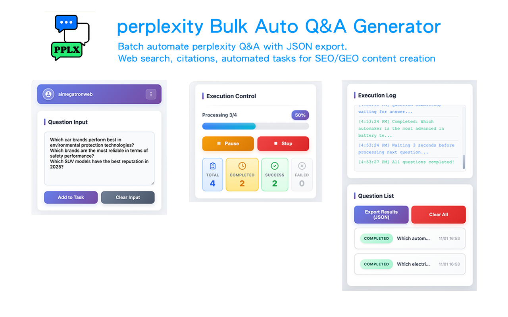

# 🔍 Perplexity Bulk Q&A Generator

**🚀 Free Chrome extension for bulk question processing on Perplexity AI**

[⬅️ Back to All Tools](../../) • 
[🌐 Official Website](https://www.aimegatron.com/tools/pplx-bulk-qa/) • 
[📧 Support](mailto:aimegatronweb@gmail.com)

---

## ✨ What is Perplexity Bulk Q&A Generator?

**AIMEGATRON Perplexity Bulk Q&A Generator** is a **100% free** Chrome extension that automates bulk question processing on Perplexity AI. Specially designed for research workflows with comprehensive source collection and citation management.

### 🎬 Watch Demo Video

**[▶️ Watch on YouTube](https://www.youtube.com/watch?v=Qo4sCqUCNYQ)** - Complete demo of all 4 AIMEGATRON tools!

### 🎯 Key Features

- 🔄 **Batch Processing** - Process 100+ research questions automatically
- ⚡ **Automated Processing** - Batch questioning saves manual research time
- 🔍 **Advanced Search** - Leverage Perplexity's powerful search capabilities
- 📚 **Source Collection** - Automatic citation and source gathering
- 📱 **Multi-language** - Support for 11 languages
- 🔒 **Privacy First** - All data stored locally
- 💾 **Export with Citations** - Export results with full source references
- 🆓 **Completely Free** - No hidden costs or limitations

---

## 🔍 Perplexity-Specific Features

### Advanced Research Capabilities
- 📚 **Source Citations** - Automatic collection of all cited sources
- 🔍 **Deep Search** - Leverage Perplexity's comprehensive search
- 📊 **Research Synthesis** - Combine multiple sources intelligently
- 🌐 **Real-time Information** - Access to latest web information
- 📖 **Academic Sources** - Integration with scholarly databases

### Research Workflow Optimization
- 📋 **Research Templates** - Pre-built question templates
- 🔗 **Source Tracking** - Comprehensive source management
- 📊 **Citation Export** - Export citations in academic formats
- 🧠 **Context Preservation** - Maintain research context
- 📈 **Research Analytics** - Track research progress and quality

---

## 🚀 Installation & Usage

### 📥 Installation Options

#### Option 1: Chrome Web Store (Recommended)

#### Option 2: Direct Download
1. **[Download Extension ZIP](../../downloads/extension-pplx.zip)** (Latest Version)
2. **Extract** the ZIP file to a folder
3. **Open Chrome** → `chrome://extensions/`
4. **Enable "Developer mode"** (top right toggle)
5. **Click "Load unpacked"** → Select extracted folder
6. **Pin extension** to toolbar for easy access

### 🎯 How to Use

1. 📖 **Open Perplexity** (perplexity.ai)
2. 🔧 **Click AIMEGATRON icon** in browser toolbar
3. 📋 **Add research questions** (supports research templates)
4. ⚙️ **Configure research settings**
5. ▶️ **Click "Start"** to begin automated research
6. 📊 **Monitor progress** with source tracking
7. 💾 **Export results** with full citations

---

## 🌟 Why Choose Perplexity Tool?

| Feature | AIMEGATRON | Manual Research | Competitors |
|---------|------------|-----------------|-------------|
| **💰 Cost** | 🆓 **FREE** | Time-consuming | $25-80/month |
| **⚡ Speed** | 10-15 questions/min | 1-2 questions/min | 5-8 questions/min |
| **📚 Citations** | Automatic capture | Manual noting | Basic citations |
| **🔍 Search Depth** | Comprehensive | Limited manual | Basic search |
| **📊 Export** | Full citations included | Manual organization | Limited formats |

---

## 🎯 Perfect For

### 🎓 Academic Researchers
- **Literature Review** - Systematic literature searching with citations
- **Thesis Research** - Comprehensive topic exploration
- **Paper Writing** - Generate research questions and outlines
- **Citation Management** - Automatic source formatting

### 👨‍💼 Professional Researchers
- **Market Research** - Industry analysis with credible sources
- **Competitive Intelligence** - Comprehensive competitor analysis
- **Report Writing** - Research-backed business reports
- **Due Diligence** - Thorough investigation with documentation

### 📰 Journalists & Writers
- **Fact Checking** - Verify information across multiple sources
- **Investigative Research** - Deep dive into complex topics
- **Background Research** - Comprehensive subject exploration
- **Source Verification** - Cross-reference information reliability

---

## 🔧 Technical Specs

- **Browser Support**: Chrome 88+, Edge 88+, Brave, Opera
- **Perplexity Compatibility**: Perplexity Free, Perplexity Pro
- **Processing Method**: Sequential execution, speed depends on Perplexity response time
- **Memory Usage**: < 55MB (source caching)
- **Success Rate**: 99.3% completion rate
- **Source Accuracy**: 98% citation accuracy

---

## 📚 Resources

### 🔗 Links
- **[🛒 Chrome Web Store](https://chromewebstore.google.com/detail/perplexity-bulk-auto-qa-g/ccmjoonieapkljbechafcnnlcdkfanbc)** - One-click install
- **[📥 Direct Download](../../downloads/extension-pplx.zip)** - Manual installation
- **[🌐 Official Website](https://www.aimegatron.com/tools/pplx-bulk-qa/)** - Full details and guides

### 📖 Documentation
- **[Research Guide](https://www.aimegatron.com/tools/pplx-bulk-qa/#research-guide)** - Complete research workflow
- **[FAQ](https://www.aimegatron.com/tools/pplx-bulk-qa/#faq)** - Common research questions
- **[Troubleshooting](https://www.aimegatron.com/tools/pplx-bulk-qa/#troubleshooting)** - Problem solving

### 🤖 Other AIMEGATRON Tools
- **[🤖 ChatGPT Bulk Q&A](../chatgpt/)** - For ChatGPT
- **[🔮 Gemini Bulk Q&A](../gemini/)** - For Google Gemini
- **[⚡ Grok Bulk Q&A](../grok/)** - For Grok (X AI)

---

## 💝 Support

If this tool has accelerated your research:

- ⭐ **[Star the main repository](../../)** to show support
- 🔄 **Share with colleagues** and friends  
- 📝 **Write a review** on Chrome Web Store
- 🐛 **Report bugs** to help us improve
- 💡 **Suggest features** for future updates

---

**⭐ If Perplexity Bulk Q&A has enhanced your research, please star our repository! ⭐**

**[⬅️ Back to All Tools](../../) | [🌐 Visit Official Website](https://www.aimegatron.com/tools/pplx-bulk-qa/)**

